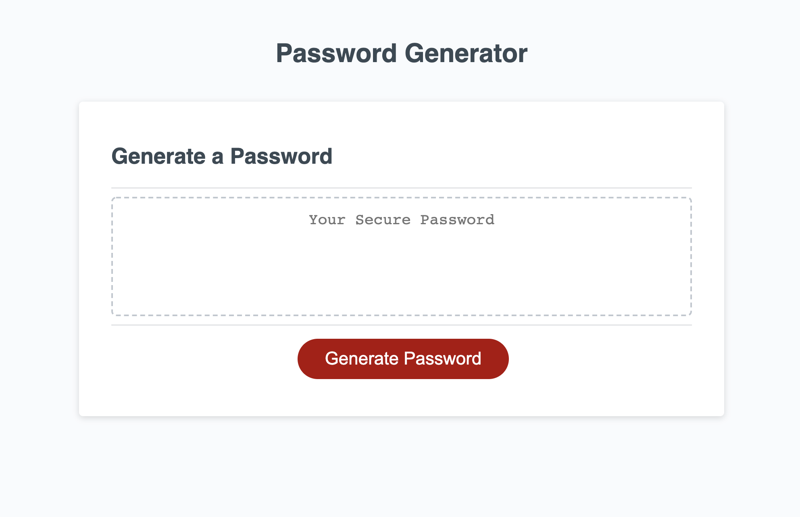

# Password-Generator
 This random password generator will generate a password of your desired character amount within the range of 8-128 characters. User has option to pick what criteria they'd like for their passwords. If you'd like to you password to be 50 characters long and all upper case letters, feel free to do so!

## Feautres

This web application consists of: 
 - Prompt for desired character length
 - Four confirms for: Special characters, Upper case letters, Lower case letters, and Numbers 

 ## Web application Image

 

 

## Built With

* JavaScript 
* Git - version control system to track changes to source code
* GitHub - hosts repository that can be deployed to GitHub Pages

## Deployed Link

* [See Live Site](https://leslievill.github.io/Password-Generator/)

## Authors

* **Leslie Villatoro** 
- [Link to Github](https://github.com/leslievill)
- [Link to LinkedIn](www.linkedin.com/in/leslie-villatoro-a3632a1a3)

## License

This project is licensed under the MIT License 
